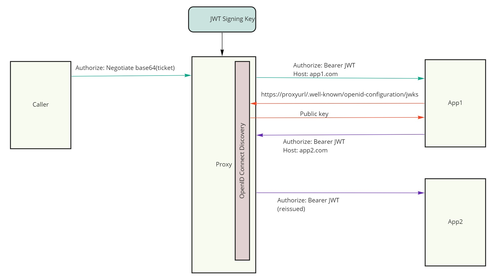
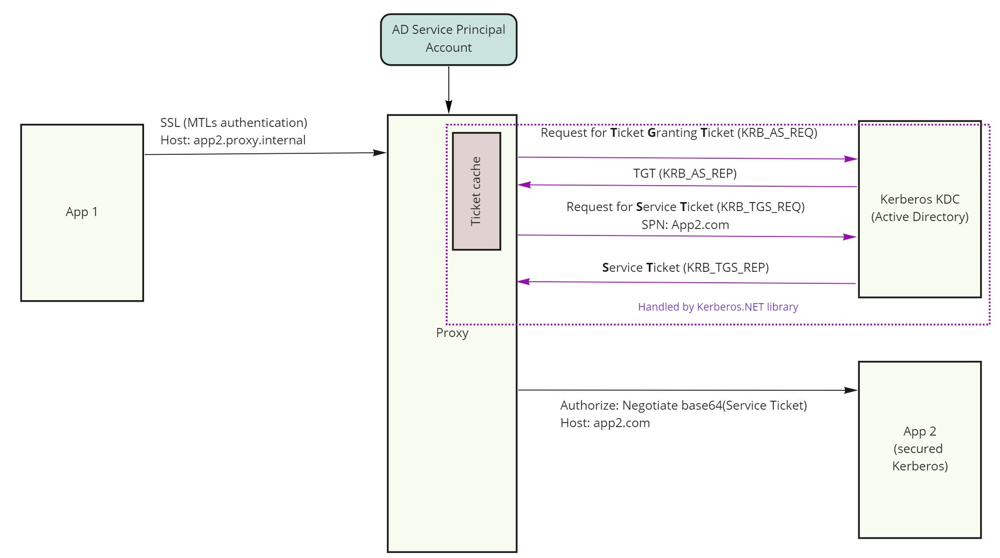

## Kerberos Authentication Proxy

This project allows placing a bi-directional transparent proxy for the app that transforms Kerberos tickets into JWT. **This allows authenticating Kerberos clients without having to run on domain joined Windows machine or configuring MIT Kerberos on Linux, and works on any platform supported by .NET 5 (Windows, Linux, OSX)**. This solution works very well for supporting legacy apps when adopting cloud and container based environments.  When configured for ingress it will validate incoming Kerberos tickets in HTTP [SPNEGO](https://en.wikipedia.org/wiki/SPNEGO).  This project allows solving for Kerberos authentication scenarios when ticket is transmitted via HTTP Negotiate header (aka Integrated Windows Authentication) header and send user's principal to downstream app as a standard JWT Bearer token. When configured for egress it will authenticate the app using authentication method of choice (MTLs is recommended), acquire Kerberos tickets on application behalf and append it to outgoing request. This approach works for applications that are using HTTP Header to transmit to Kerberos ticket, such as:

- Front end web applications
- WCF services with `basicHttpBinding`, and transport level Windows security (requires using JWT WCF middleware)

It does not work for the following scenarios:

- SQL Server Integrated Authentication
- WCF services using `wsHttpBinding` (ticket is part of SOAP payload rather then header)
- Services that require Kerberos delegation (maybe possible via future enhancement)

## Getting Started 

Configure proxy settings by editing `application.yaml`

1. Set correct AD settings under `SPNEGO` section 
2. Set JWT signing key. You can generate new one via included utility by running `dotnet run generate-key` in `src\KerberosUtil` folder.
3. Configure routing. Full documentation can be found in [official YARP documentation](https://microsoft.github.io/reverse-proxy/).

## Ingress

When configured as reverse proxy, the incoming requests are matched to a specific route defined in configuration. If the route is associated with an authorization policy, it will be applied. If the user fails to supply a valid Kerberos ticket in the request, the request will end with a `401 Unauthorized` and the request will not be proxied to the destination. 

The Kerberos ticket verification implementation relies on fully managed Kerberos ticket parser provided via [Kerberos.NET](	<https://github.com/SteveSyfuhs/Kerberos.NET>) library and does not require any communication with the domain controller when validating incoming tickets.

### Principal propagation
When the proxy successfully establishes the security principal (identity of the caller + any additional claims) from the Kerberos ticket, it serializes established security principal into JWT and appends it as a standard Bearer token to proxied request. Kerberos tickets contain AD groups the user belongs to, but they are in [SID](https://en.wikipedia.org/wiki/Security_Identifier) format, and are not sent downstream by default. If you want to make assertions on roles, you need to configure LDAP for the route service which will be used to map SIDs to their common names. When configured it will send AD groups as part of the principal propagation mechanism. Groups are loaded on startup and cached in memory. The proxy will do a periodic light weight incremental query to check if AD groups configuration has changed. The associated middleware will expand full hierarchy of AD groups based on their associations (ex. if user is only assigned group called `Foo`, and `Foo` is *memberOf* group `Bar`, then principal will show that the user belong to both). In order to enable additional claims loading, `Spnego:Ldap` section of configuration must be filled out. Additional user claims can be loaded from LDAP and mapped to specific claim type like this:

```yaml
Spnego:
  Ldap:
    Claims: # see System.Security.Claims.ClaimTypes for standard claim types constants or use your own
      - LdapAttribute: givenName
        ClaimType: http://schemas.xmlsoap.org/ws/2005/05/identity/claims/givenname
      - LdapAttribute: sn
        ClaimType: http://schemas.xmlsoap.org/ws/2005/05/identity/claims/surname
      - LdapAttribute: email
        ClaimType: http://schemas.xmlsoap.org/ws/2005/05/identity/claims/emailaddress
      - LdapAttribute: memberof
        ClaimType: http://schemas.microsoft.com/ws/2008/06/identity/claims/role
```


The proxy forwards the principal as a JWT token to the target application. The JWT token is signed with an RSA signing key. The calling application can validate the token by retrieving the signing public key that the proxy publishes via standard OpenID Connect discovery mechanism. 



The sample payload section of the JWT sent downstream would look as following:

```json
{
  "nbf": 1623776653,
  "exp": 1623776713,
  "iss": "http://localhost:8081",
  "http://schemas.xmlsoap.org/ws/2005/05/identity/claims/sid": "S-1-5-21-3483396884-3677748265-799010679-1105",
  "http://schemas.xmlsoap.org/ws/2005/05/identity/claims/givenname": "iwaclient",
  "http://schemas.xmlsoap.org/ws/2005/05/identity/claims/nameidentifier": "ALMIREX\\iwaclient",
  "http://schemas.microsoft.com/ws/2008/06/identity/claims/role": [
    "Users",
    "MyGroup2",
    "MyGroup"
  ]
}
```

JWT signing key can be easily generated by running the following command inside util projects folder:
```
dotnet run generate-key
```

## Configuring routes

Incoming requests are matched to a destination routes by associating them with a named cluster. A cluster defines one or more destination URLs to which request should be forwarded. A basic ingress configuration may look as following:

```yaml
Proxy:
  Routes: # Routes tell the proxy which requests to forward
    IngressStaticDestination:
      ClusterId: httpbin
      AuthorizationPolicy: default # defaults to required authenticated user
      Match:
        Hosts:
          - httpbin.org
      Transforms:
        - AuthorizationScheme: Bearer # issue JWT tokens with caller's identity
  Clusters: # Clusters tell the proxy where and how to forward requests
    httpbin:
      Destinations:
        httpbin/1:
          Address: https://httpbin.org
```


## Egress

The proxy can work in forwarding mode by acquiring Kerberos tickets and appending them to any outgoing requests. This is useful when application running on modern cloud platform needs to communicate to a legacy service secured by Kerberos. The Kerberos ticket will be obtained from Active Directory KDC using Kerberos.NET library and appended to the outgoing request as `Authorize: Negotiate base64(kerb-ticket`. 




### Authenticating to the proxy

The calling application must authenticate to the proxy in a way that ensures only legitimate calls can be sent to target app. MTLs or API key are preferred modes. You can use API-Key authentication by setting `ApiKey`  property in configuration and applying authorization policy on any egress routes. See sample below

**Egress route example**

```yaml
ApiKey: mykey
Proxy:
  Routes: # Routes tell the proxy which requests to forward
    EgressStaticDestination:
      ClusterId: httpbin
      AuthorizationPolicy: ValidApiKey
      Match:
        Hosts:
          - httpbin.local
      Transforms:
        - AuthorizationScheme: Negotiate # acquires and appends Kerberos tickets
  Clusters: # Clusters tell the proxy where and how to forward requests
    httpbin:
      Destinations:
        httpbin/1:
          Address: https://httpbin.org
```


## Configuring for Cloud Foundry

The proxy can be used to secure applications running on Cloud Foundry by configuring it as a [route service](https://docs.cloudfoundry.org/services/route-services.html). This will allow it to intercept any application requests before forwarding them to the destination. When running as a route service, the destination where to forward the request should be sent is specified by the GoRouter via `X-CF-Forwarded-Url` http header. As such, a special cluster is used that doesn't have any destination, but is tagged with special metadata as following:

```yaml
Proxy:
  Clusters:
    cloud-foundry-route-service:
      Destinations:
        any-url:
          Metadata:
            Type: route-service
```

For egress scenarios, when proxy and calling apps are both running on the platform, authenticating to the proxy is best done with MTLs using platform provided [container identity certificates](https://docs.cloudfoundry.org/devguide/deploy-apps/instance-identity.html). The proxy is already configured to use MTLs authentication. There are two authorization policies that can be applied to routes via `AuthorizationPolicy` configuration key:

- `sameorg` - accepts any request originating from the app that is deployed in same org as the proxy
- `samespace` - accepts any request originating from the app that is deployed in same space as the proxy

## How to build

- Install [.NET Core 5.0 SDK](<https://dotnet.microsoft.com/download>)
- Run `dotnet publish`

## Troubleshooting

- Ensure that Service principal you're using has the appropriate SPN associated with it. For apps that use user's browser as the client, set spn to `http/fqdn`, for WCF apps set to `host/fqdn`

- If testing via browser, ensure that the site is allowed to perform negotiate authentication. For IE & Chrome this is done by adding site to Trusted list in security settings. For Firefox, open up `about:config` and set fqdn in `network.negotiate-auth.trusted-uris`

- Ensure you're testing from domain joined machine

  

## Testing via Postman
Normally when using browser on domain joined machine, a Kerberos ticket will be automatically obtained by the browser from the OS and attached to the header. You can however craft a manual request with Postman. A collection of sample requests is provided as a Postman collection you can import, which can be found in `samples` directory.

Note that some requests obtain Kerberos ticket via Postman pre-request script. It requires that you run `dotnet run get-ticket --start-server` with rest of the arguments specific to your AD environment. This will allow postman to automatically acquire and attach Kerberos tickets from the started web service.
